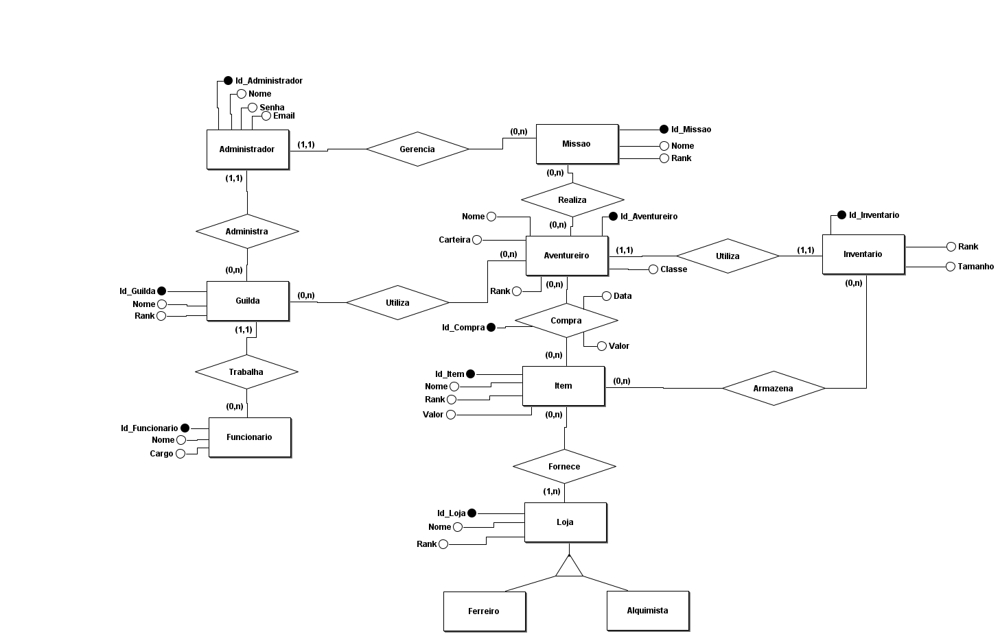

# Guild_Mannagent_Resource

**Resumo**

Um projeto de gerenciamento de guilda, focado em aventureiros e em realizações de missões, tendo em vista em fazer o CRUD da disciplina de Desenvolvimento de Software Avançado.  

Palavras-Chaves: RPG - Sistema de Gerência - API.

**Introdução**

Em uma guilda de aventureiros, o líder de guilda enfrenta problemas de gerenciamento de todas a funções básicas no sistema de missões e entrada/saída de aventureiros, tendo isso em vista, para otimizar seu tempo e bolar estratégias em tempo real, o sistema precisa ter:   

> Três classes básicas: Guerreiro, Mago, Assassino. Para o aventureiro é permitido selecionar quaisquer dos itens da sua bolsa dos tipos bônus armadura, bônus acessório(resistência mágica), bônus de ataque.

> Missões são controladas pela Guilda, e cada uma delas será ofertada de acordo com sua ranked na guilda. Vale ressaltar que o líder/Administrador irá cadastrar e/ou excluir os itens e missões. 

> Cada aventureiro poderá se cadastrar ou sair da guilda. Tendo nome, rank, número de registro(cpf), habilidades(skills), uma passiva e seus itens. Somente o administrador autonomia de aumentar ou diminuir o rank entre os membros

Um sistema funcional aplicado para todas as funções básicas de missões uma guilda: cadastrar e deletar missões. O aventureiro, pode selecionar, participar e desistir da missão. Além de que na Guilda, pode manipular cadastro e rank dos aventureiros. E que
tem um controle de status dos aventureiros: rank, classe, itens.

Vai ter um sistema de controle dos status no Aventureiro: Stamina, Missões Feitas, Missões Fracassadas, Missões Desistentes, Sorte do Aventureiro. Além de proporcionar melhorias para seus aventureiros, dado o nível da guilda. Onde o líder da guilda/administrador pode proporcionar outras estalagens com a de dormir na guilda, o aventureiro se divertir na guilda para melhorar o fator sorte nas missões, o de ferreiro para melhoria de equipamentos e melhores alquimistas para vender poções que ajudem mais seus aventureiros. Para esses estabelecimentos vão existir dois tipos de melhorias, a de estrutura, onde podemos contratar mais funcionários e a de melhoria diretamente no funcionário atual por nível. 

**Backlog** (Lista de Requisitos):
- Cadastrar itens.
- Cadastrar Missão.
- Cadastrar Aventureiro (Guerreiro, Mago ou Assassino).
- Cadastrar Administrador.
- Cadastro de Funcionários.
- Mudar Rank Aventureiro.
- Começar Missão.
- Concluir Missão.
- Desistir Missão.
- Usar Item (Missão).
- Comprar Item.
- Usar Item.
- Divertir (Salão de Festas).
- Equipar Arma.
- Melhorar Arma.
- Comprar Arma.
- Dormir Guilda.
- Listar Aventureiros. 
- Listar Itens da Guilda.
- Listar Missões.
- Log da Guilda.
- Log de Aventureiro.
- Log de Missões.
- Doar Dinheiro Para Guilda.
- Melhorar Estrutura (Salão de Festas, Estalagem, Casa de Fundição, Casas de Poções).
- Melhorar Funcionários.
- Contratar Funcionários.

## Modelo entidade relacionamento

## Respostas

| Código | Descrição |
|---|---|
| `200` | Requisição executada com sucesso (success).|
| `400` | Erros de validação ou os campos informados não existem no sistema.|
| `401` | Dados de acesso inválidos.|
| `404` | Registro pesquisado não encontrado (Not found).|
| `422` | Dados informados estão fora do escopo definido para o campo.|

## Controllers 

### Guilda endpoints
| Função | Controller |
|---|---|
| Cadastrar guilda | `Post /guilda` |
| Buscar guilda por id| `Get /guilda/{id}`|
|Alternar rank da guilda | `Put /guilda/{id}`|
|Alterar nome da guilda| `Put /guilda/{id}`|
|Alterar dinheiro da guilda| `Put /guilda/{id}`|

### Funcionário EndPoint
| Função | Controller |
|---|---|
|Cadastrar Funcionário| `Put /funcionario`|
|Listar todos os funcionários de uma guilda| `Get /funcionarios/guilda/{id}`|
|Buscar funcionario por Id| `Get /funcionarios/{id}`|
|Alterar funcionario| `Put /funcionarios/{id}`|
### Missão EndPoint
| Função | Controller |
|---|---|
|Cadastrar missão| `Put /missoes`|
|Listar todas as missoes de uma guilda| `Get missoes/guilda/{id}`|
|Listar todas as missoes concluídas de uma guilda| `Get /missoes/concluidas/guilda/{id}`|
|Listar todas as missões incompletas de uma guilda| `Get /missoes/incompletas/guilda/{id}`|
|Listar todas as missões Fracassadas de uma guilda| `Get /missoes/fracassadas/guilda/{id}`|

### Aventureiro EndPoint
| Função | Controller |
|---|---|
|Cadastrar Aventureiro| `Post /aventureiros`|
|Atualizar aventureiro| `Put /aventureiros`|
|Comprar Item| `Get /aventureiros/{id_Aventureiro}/item/{id_Item}`|
|Equipar Item| `Get /aventureiros/{id_Aventureiro}/item/{id_Item}`|
|Realizar Missão| `Get /aventureiros/{id_Aventureiro{/missao/{id_missao}`|
|Verificar valor da Carteira| `get /aventureiro/{id}/carteira`|

### Inventario EndPoint
| Função | Controller |
|---|---|
|Melhorar Inventario| `Put /inventarios/{id}/melhoria`|
|Buscar item de aventureiro| `get /inventarios/{id_Inventario}/aventureiro/{id_Aventureiro}`|
|Listar todos os itens de um aventureiro| `get /inventarios/aventureiro/{id}`|
|Listar todos os itens equipados de um aventureiro| `get /inventarios/aventureiro/{id}/equipado`|
|Listar todos os itens não equipados de um aventureiro| `get /inventarios/aventureiro/{id}/desequipados`|

### Loja EndPoint
| Função | Controller |
|---|---| 
|Cadastrar Loja| `Post /lojas`|
|Atualizar Loja| `Put /lojas/{id}`|
|Listar todos os itens de uma loja| `Get /lojas/{id}`|
|Listar os itens em estoque de uma loja| `Get /lojas/{id}/disponivel`|
|Listar os itens indisponivel de uma loja| `Get /lojas/{id}/indisponivel`|
|Cadastrar Item| `Post /lojas/item`|
|Melhorar Item| `Put /lojas/item/{id}`|

### Administrador Enpoint 
| Função | Controller |
|---|---|
|Cadastrar Administrador| `Post /administradores`|
|Atualizar Administrador| `Put /administradores/{id}`|
|Remover Administrador| `Delete /administradores/{id}`|
|Listar Todos os Administradores| `Get /administradores`|
|Listar Todos os administradores de uma Guilda| `Get /administradores/guilda/{id}`|
|Listar Todas as Guildas de um Administrador| `get /administradores/{id}/guilda`|
|Apagar uma guilda de um administrador| `Delete /administradores/{id_Administrador}/guilda/{id_Guilda}`|

Equipe:
- Annielle Crispime e Medeiros **(PO, Gerente de Projetos, Dev)**
- Jean Carlos Ferreira da Silva Filho **(Desesenvolvimento)**

**Status do Projeto:**
Em Desenvolvimento
